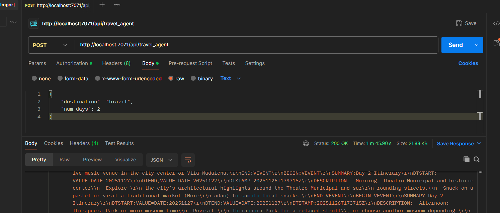

# Serverless Computing
Examples are made using azure cloud resources
## Installing Azure Functions Core Tools
### Windows
1. **Using Windows Package Manager (winget)**
   ```
   winget install Microsoft.Azure.FunctionsCoreTools
   ```
2. **Alternative: Using npm**
   ```
   npm install -g azure-functions-core-tools@4 --unsafe-perm true
   ```
3. **Verify installation**
   ```
   func --version
   ```
### Linux
1. **Ubuntu/Debian - Add Microsoft package repository**
   ```bash
   curl https://packages.microsoft.com/keys/microsoft.asc | gpg --dearmor > microsoft.gpg
   sudo mv microsoft.gpg /etc/apt/trusted.gpg.d/microsoft.gpg
   ```
2. **Add the package source**
   ```bash
   sudo sh -c 'echo "deb [arch=amd64] https://packages.microsoft.com/repos/microsoft-ubuntu-$(lsb_release -cs)-prod $(lsb_release -cs) main" > /etc/apt/sources.list.d/dotnetdev.list'
   ```
3. **Install the tools**
   ```bash
   sudo apt-get update
   sudo apt-get install azure-functions-core-tools-4
   ```
4. **Alternative: Using npm (any distro)**
   ```bash
   npm install -g azure-functions-core-tools@4 --unsafe-perm true
   ```
### macOS
1. **Using Homebrew**
   ```bash
   brew tap azure/functions
   brew install azure-functions-core-tools@4
   ```
2. **Alternative: Using npm**
   ```bash
   npm install -g azure-functions-core-tools@4 --unsafe-perm true
   ```

3. **Verify installation**
   ```bash
   func --version
   ```
**Note:** The npm method works across all platforms but requires Node.js to be installed first.

## Step-by-Step Guide: Deploy Local Azure Function to Azure Functions (Flex Consumption Plan)

### Prerequisites
- Azure Functions Core Tools installed
- Azure CLI installed
- An Azure account with an active subscription
- A local Azure Functions project

**Read more in:** https://learn.microsoft.com/en-us/azure/azure-functions/functions-run-local

### Step 1: Login to Azure CLI with Specific Tenant
Use the `az login` command to sign in interactively. For a specific tenant:
```bash
# Login to a specific tenant
az login --tenant <TENANT_ID>
```
**Verify your login and subscription**
```bash
# Show current account
az account show

# List all subscriptions
az account list --output table

# Set specific subscription (if needed)
az account set --subscription <SUBSCRIPTION_ID>
```

**Read more in:** https://learn.microsoft.com/en-us/cli/azure/authenticate-azure-cli-interactively?view=azure-cli-latest
### Step 2: Test Your Function Locally (Optional but Recommended)
Before deploying, test your function locally:
```bash
# Navigate to your function project directory
cd /path/to/your/function/project
# Start the local Functions runtime
func start
```
Test the HTTP endpoint shown in the output (usually `http://localhost:7071/api/YourFunctionName`).

**Read more in:** https://learn.microsoft.com/en-us/azure/azure-functions/functions-develop-local

### Step 3: Deploy Your Local Function to Azure

#### Option 1: Using Azure Functions Core Tools
This is the recommended method
```bash
# Navigate to your project directory
cd /path/to/your/function/project

# Deploy to Azure
func azure functionapp publish MyFlexFunctionApp
```
**With local settings sync:**
```bash
func azure functionapp publish MyFlexFunctionApp --publish-local-settings
```
#### Option 2: Using Azure CLI with ZIP Deployment
After building and zipping your code, deploy to a blob storage container.
This method is not available for flex consumtion tier.

**Create a ZIP package:**
```bash
# For PowerShell
Compress-Archive -Path * -DestinationPath ./function-app.zip

# For Bash/Linux
zip -r function-app.zip .
```

**Deploy the ZIP package:**
```bash
az functionapp deployment source config-zip \
  --resource-group "MyFunctionAppRG" \
  --name "MyFlexFunctionApp" \
  --src ./function-app.zip
```

## Step 4: Verify Deployment
#### Test your deployed function:
```bash
# For HTTP triggered functions
curl https://MyFlexFunctionApp.azurewebsites.net/api/YourFunctionName
```

Or using postman:


### View logs:
```bash
# Stream logs
func azure functionapp logstream MyFlexFunctionApp
```

**Or using Azure CLI:**
```bash
az webapp log tail \
  --resource-group "MyFunctionAppRG" \
  --name "MyFlexFunctionApp"
```

## Additional Resources

- **Official Documentation:** https://learn.microsoft.com/en-us/azure/azure-functions/flex-consumption-plan
- **Flex Consumption Samples:** https://github.com/Azure-Samples/azure-functions-flex-consumption-samples
- **Azure Functions Core Tools Reference:** https://learn.microsoft.com/en-us/azure/azure-functions/functions-core-tools-reference
